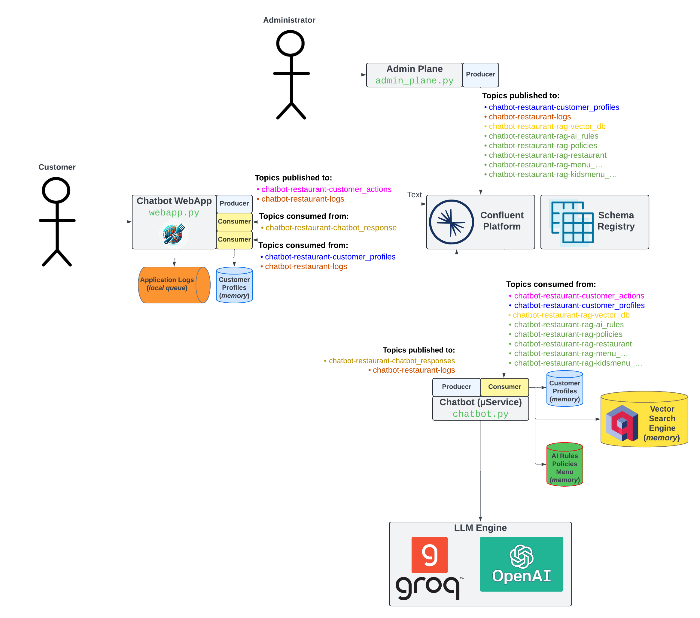

# chatbot-restaurant
Chatbot for a restaurant using [OpenAI](https://openai.com/) and [Confluent](https://www.confluent.io/lp/confluent-kafka).

## Demo Diagram




## Requirements
- [curl](https://curl.se/)
- [Docker Desktop](https://www.docker.com/products/docker-desktop/)
- [Python 3.8+](https://www.python.org/)

## The Demo
This demo runs all on Docker and it was only tested on a MAC M1. In case needed change the platform option to your needs (see variable `PLATFORM` on the file `.env`).

To be able to interact with OpenAI, you will need the following API key:
* [OpenAI](https://openai.com/) LLM model
  - Follow steps from [here](https://platform.openai.com/docs/quickstart/account-setup) to create an Account and then an API Key only

Having the API key at hand, create a file named `.env_demo` file by executing the command:
```bash
cat > .env_demo <<EOF
export OPENAI_API_KEY=<OpenAI_Key_here>
export PASSWORD_SALT="Stre4mb1te$-G3n-AI-Dem0"
export BASE_MODEL="gpt-3.5-turbo-16k"
EOF
```

You are now ready to start the demo!

### Running the demo
To automatically start the demo, run `./demo.sh -x`, once the docker images are downloaded, it should take less than 2 minutes to have everything up and running.
```
2024-03-22 17:17:02.000 [INFO]: Setting environment variables
2024-03-22 17:17:02.000 [INFO]: Starting docker compose
[+] Building 1.1s (12/12) FINISHEDdocker:desktop-linux
 => [chatbot internal] load build definition from Dockerfile
 => => transferring dockerfile: 282B
 => [chatbot internal] load metadata for docker.io/library/python:3.8-slim-buster
 => [chatbot internal] load .dockerignore
 => => transferring context: 2B
 => [chatbot 1/7] FROM docker.io/library/python:3.8-slim-buster@sha256:8799b0564103a9f36cfb8a8e1c562e11a9a6f2e3bb214e2adc23982b36a04511
 => [chatbot internal] load build context
 => => transferring context: 1.94kB
 => CACHED [chatbot 2/7] RUN apt-get update -y && apt-get install curl -y
 => CACHED [chatbot 3/7] WORKDIR /src
 => CACHED [chatbot 4/7] COPY src/requirements.txt requirements.txt
 => CACHED [chatbot 5/7] RUN pip install --no-cache-dir -r requirements.txt
 => CACHED [chatbot 6/7] COPY .env_demo .
 => CACHED [chatbot 7/7] COPY src/ .
 => [chatbot] exporting to image
 => => exporting layers
 => => writing image sha256:ad1b103d2f2eea3d21774c13794b2b76ae4de431f1c8e03b65c61677d8f83d6b
 => => naming to docker.io/library/chatbot-restaurant-chatbot
[+] Running 5/6
 ⠧ Network chatbot-restaurant_default  Created
 ✔ Container zookeeper                 Started
 ✔ Container broker                    Started
 ✔ Container schema-registry           Started
 ✔ Container control-center            Started
 ✔ Container chatbot                   Started

2024-03-22 17:17:04.000 [INFO]: Waiting Schema Registry to be ready.........
2024-03-22 17:17:14.000 [INFO]: Waiting Confluent Control Center to be ready.......
2024-03-22 17:17:21.000 [INFO]: Waiting HTTP Server to be ready.
2024-03-22 17:17:22.000 [INFO]: Demo environment is ready!
```

At the end of the start up script, it should open the following web pages:
 - Confluent Control Center: http://localhost:9021
 - Chatbot Web application: http://localhost:8888

### Stopping the demo
To stop the demo, please run `./demo.sh -p`.

```
2024-03-22 17:29:07.000 [INFO]: Stopping docker compose

[+] Running 6/5
 ✔ Container chatbot                   Removed
 ✔ Container control-center            Removed
 ✔ Container schema-registry           Removed
 ✔ Container broker                    Removed
 ✔ Container zookeeper                 Removed
 ✔ Network chatbot-restaurant_default  Removed

2024-03-22 17:29:30.000 [INFO]: Demo successfully stopped
```

## Runtime Demo and Screenshots
Demo


Login screen


Customer Profiles available. To access that page go to http://localhost:8888/profiles (password is the same as the username)


Initial message after login


Asking for the main menu


Going through some of the restaurant policies


## External References
Check out [Confluent's Developer portal](https://developer.confluent.io), it has free courses, documents, articles, blogs, podcasts and so many more content to get you up and running with a fully managed Apache Kafka service.

Disclaimer: I work for Confluent :wink: